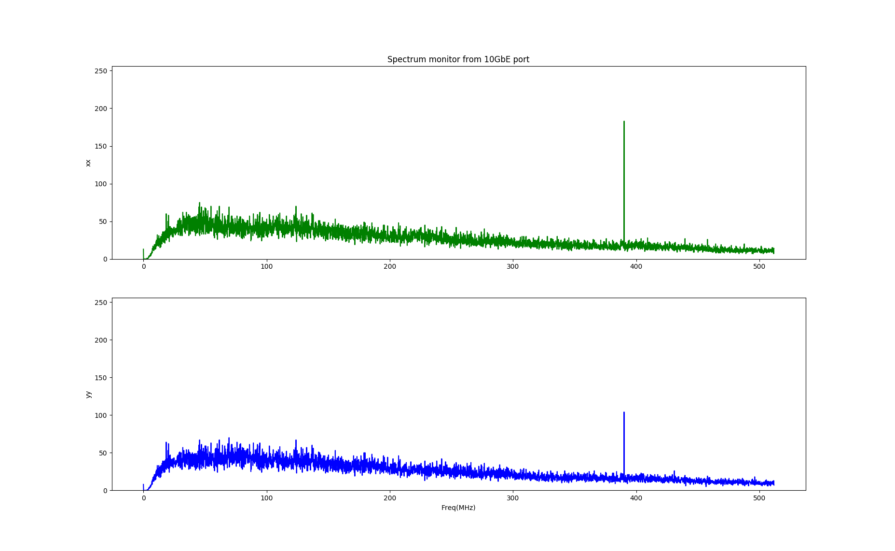
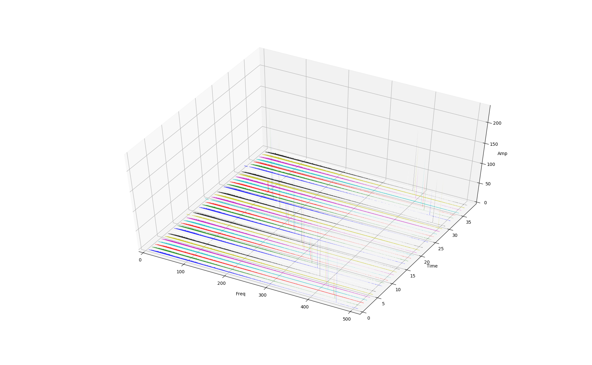
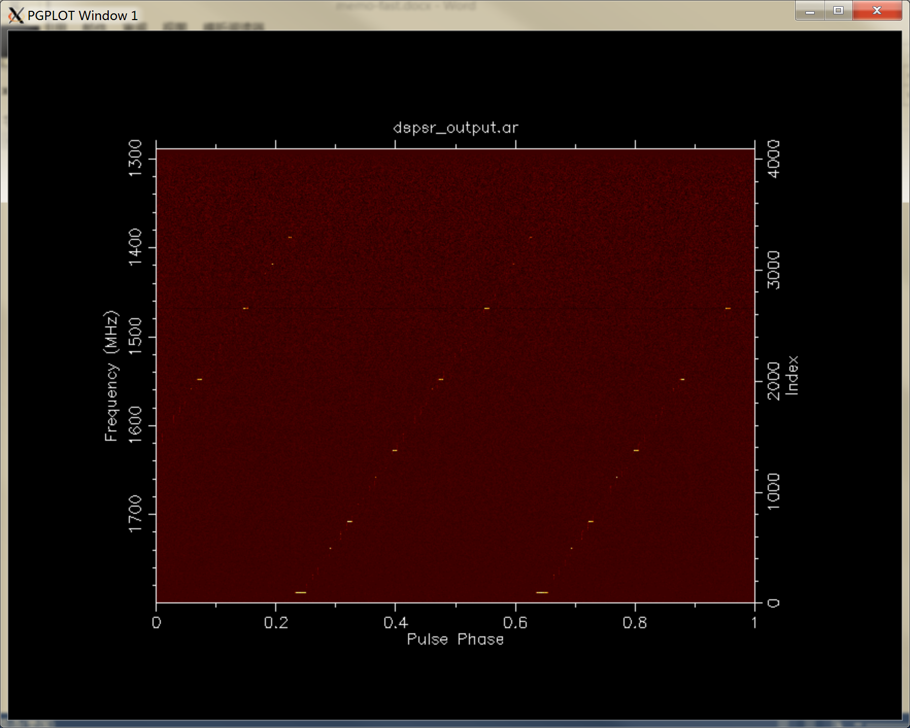
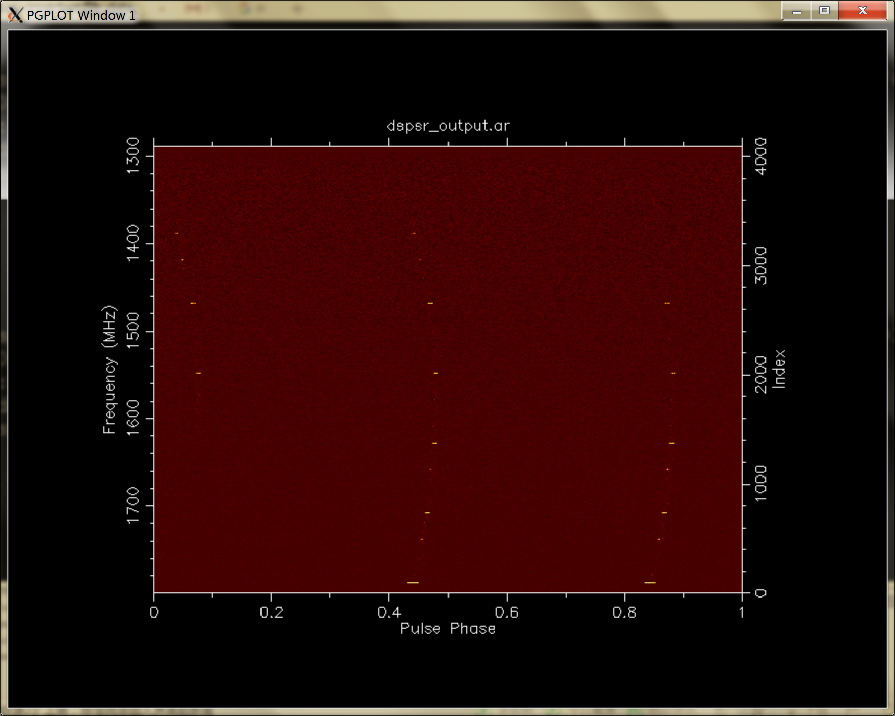
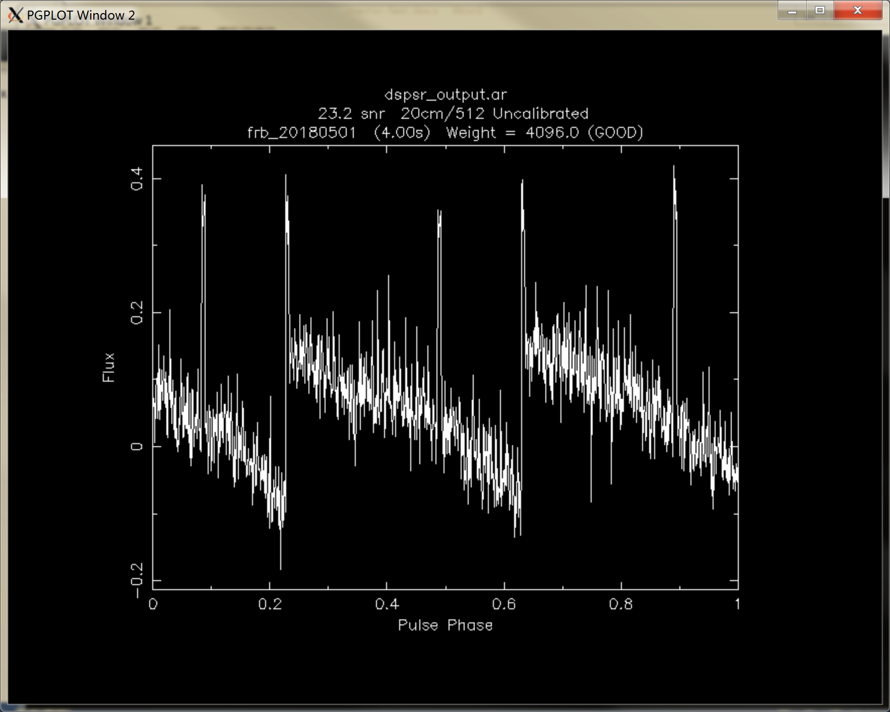
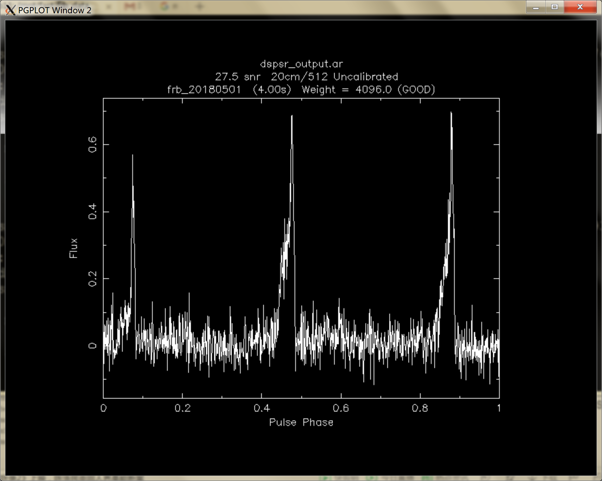

# Fast-roach2 test benchmark memo
### Network setting
* IP adress
	* GPU server<br>
	1Gb port: 159.226.170.68<br>
	10Gb port: 192.168.1.127 # p2p1, FRB power term<br>
	10Gb port: 192.168.2.127 # p2p2, FRB cross term<br>
  	10Gb port: 192.168.3.127 # p2p3, SETI pol 1 term<br>
    10Gb port: 192.168.4.127 # p2p4, SETI pol 2 term<br>    
	* roach2<br>
1Gb port: 10.128.2.8<br>
	10Gb port: 192.168.1.227 # FRB power term<br>
	10Gb port: 192.168.2.227 # FRB cross term<br>
  	10Gb port: 192.168.3.227 # SETI pol 1 term<br>
    10Gb port: 192.168.4.227 # SETI pol 2 term<br>
* 10Gb network tricks in Hashpipe
	* Code using packet sockets (or raw sockets) will see packets before iptables sees them.  The s6_pktsock_thread uses packet sockets to receive the packets.  The IP stack is not aware of this, so as far as it is concerned there are no listeners so for each S6 packet received the IP stack would send a "no listener" ICMP packet in response. These ICMP packets were generating unwanted network traffic which impacted the overall throughput so to avoid them we setup iptables rules to drop all incoming UDP packets (since the only UDP packets expected were S6 packets).These iptables rules stopped the ICMP packets, but also stopped "normal" UDP receive code from seeing the packets.  
	* If you want to use normal UDP receive code, you need to remove these rules.  This can be done via:
	```javascript
	sudo iptables -F -t raw
	```
	* You can check for the rules before and after running that command by using this command:
	```javascript
	sudo iptables -L -v -t raw
	```    
	* If some of the interfaces on a netbooted machine do not come up, issue a:<br>
	```javascript
	sudo  ifup -a
	```
### Scripts and programs
	* roach2_conf.py is used to load the boffile to roach2, setup ip address and configure parameters.
	*  adapt_gain_conf.py is used to find a proper gain value for 8 bit output data. Set the gain value step by step to increase or decrease the value of output data. Once the average data falls into the preset range, the entire adaptive adjustment is completed. 
	*  receive_packets.py is used to receive the packets from all four 10Gb ports and print the header information out.
	*  netspeed.sh is used to test the network speed of a given IP adress. 
	*  topology_pnn.sh is used to get the NUMA information for Hashpipe.
	*  psrsoft_cmd has some command can be used for pulsar data processing which form different software such as sigproc,dspsr,presto,psrchieve,heimdall ...
	*  heimdall_script is shell script run on computing node for filterbank file looking and heimdall launching.  
	*  monitor_10gbe.py is used to monitor the output packets from 10GbE.Receiving the packets from 10GbE and print the head out and plot the spectrum data out.
	* waterfall_plot3D.py is used for 3 dimensions waterfall figure plot out. Receiving a given number of spectrums from 10GbE and plot in frequency, time and power.	
### Single beam test
* Generate a fake periodic pulsar signal from a sweep generator,merge the signal to a noise and inject to both polarizations.
	* sweep frequency: 500MHz to 100MHz
	* period: ~1.5 sec
	* signal amplitude: -26dBm
	* attenuation of noise source: 20dB	 
	* DM = (t2-t1)/(4.15ms)[(ν1/GHz)<sup>-2</sup>-(ν2/GHz)<sup>-2</sup>]<sup>-1</sup>=1500/4.15/(1/1.4<sup>2</sup>-1/1.8<sup>2</sup>)=1793
* The spectrum plots of both polarizations are shown in Fig.1

> Fig. 1 spectrum of both pols
* 3D waterfall plot from 10Gb port is shown in Fig.2

> Fig. 2 3D waterfall plot from 10Gb
* Waterfall pictures before and after dedispersion by DSPSR of filterbank file are shown in Fig.3 and Fig.4
* 
> Fig. 3 Waterfall before dedispersion
> 
> Fig. 4 Waterfall after dedispersion
* Time domain plots before and after dedispersion by DSPSR of filterbank file are shown in Fig.5 and Fig.6
* 
> Fig. 5 time domain before dedispersion
> 
> Fig. 6 time domain after dedispersion
